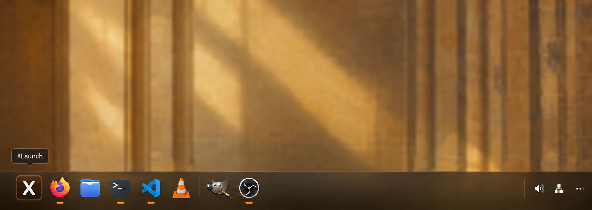
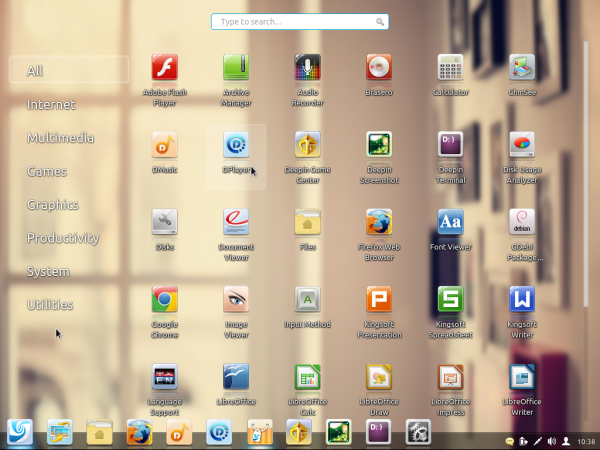

# XDock

**A compact classic desktop dock, designed alongside [XLaunch](https://github.com/ai-workspace-lab/XLaunch).**

[中文](README.zh.md) · [Design brief](docs/design-brief.md)

XDock is the independently developed dock component inspired by the bottom bar of the user-supplied 2013 DDE Classic desktop reference. It owns pinned applications, running indicators and window switching. XLaunch owns categories, application search, system actions and Agent commands.

Status: design specification only. No executable dock or platform compatibility validation is included yet.

## Amber design concept

Built-in ImageGen concept, grounded in the reference below and the selected XLaunch amber design. This is a visual mockup, not a running dock. [Generation prompts](assets/prompts.json).

## Visual reference

Use the bottom strip as the reference: edge-aligned placement, compact colorful icons and a restrained dark translucent surface over warm amber wallpaper. The full-screen launcher in this image belongs to the companion XLaunch product.

## Independent operation

- XDock must work without XLaunch or an Agent runtime.
- XLaunch may appear as an optional pinned entry.
- Shared app identity and activation contracts are planned; no hard runtime dependency.
- Target macOS 26+, GNOME 50, KDE Plasma 6.6, DDE 7.0 and Xfce through separate adapters. These are design targets, not verified support.
- No DDE suite dependency. Desktop coexistence and window-control permissions require platform validation.

Next: design the standalone dock states from the reference, then validate a platform adapter before implementation.
